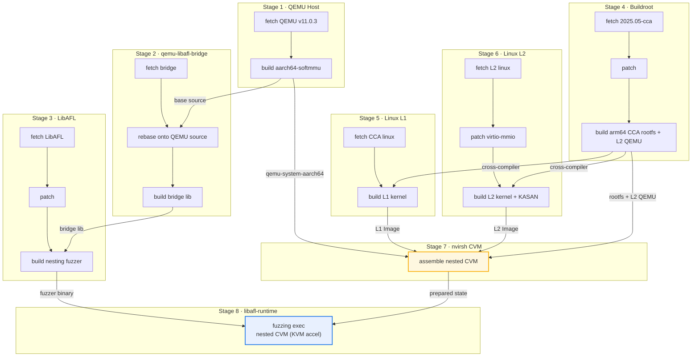

先说招生。

> **博士招生信息**
>
> 如果你对**基础软件和系统安全、AI 智能体和靶场、怎么做科研**感兴趣，欢迎联系我们。
>
> - **招生项目**：大湾区大学—哈尔滨工业大学 2027 年联合培养博士研究生，专业学位招生领域为电子信息（0854）。
> - **研究方向**：基础软件与全生命周期系统安全；网安大模型、AI 智能体与安全靶场；网络安全元科学与科研方法。
> - **联合培养导师**：哈尔滨工业大学张伟哲教授、博士生导师。
> - **培养与学位**：全日制非定向；在大湾区大学学习、住宿并开展研究，毕业证书和博士学位证书由哈尔滨工业大学颁发。
> - **入学时间**：申请—考核拟录取者可选择 2027 年春季或秋季入学，但须在入学前取得硕士学位。
> - **报名方式**：网上报名；“报考专业所在院系”选“哈尔滨工业大学（深圳）”，“专项计划”选择“大湾区”，报考前与导师联系确认。
> - **报名截止时间**：延长至 **2026 年 10 月 7 日**。
> - **联系邮箱**：请发送至 cyruscyliu@gmail.com，并抄送 wzzhang@hit.edu.cn。
>
> 完整政策与申请条件备查：<https://www.55aaseclab.com/zh/blog/gbu-hit-2027-joint-phd-admissions/>

2 月以来，coding agent 极大地提高了我的科研推进速度，我想大家都有同感。自 2 月以来，我在 EPFL 博后期间（将于今年 1 月加入大湾区大学）累计使用了 477.716 亿词元。作为博士后，我同时运转着五六个项目，已经练就了快速切换上下文的能力，但一遇到内核、hypervisor，往往还是觉得时间不够。领域知识太难了。有了 coding agent 之后，学习领域知识的阻力小了很多，但新的问题也出现了：如何保证结果稳定。于是我构建了一个用于系统安全的工作流框架，这也对我的编程能力提出了新的要求。踩了无数坑之后，我终于可以更专注地思考项目的创新和影响力，于是想写点东西，分享系统安全编程在 AI 时代的新范式。这个工作流框架已经开源在 Morpheus[^1]。系统安全编程的门槛降低了，从事系统安全研究的阻力也小了不少。下面是一些总结。

## 认知下放：请说出你的想法

提示词问题的根本是认知下放。一个好的提示词，应该说清楚要做什么、什么算错、如何修复，以及什么时候停止。认知下放得越彻底，模型的执行就越稳定；困难在于，我们必须先知道自己要做什么。在 AI 时代，人的主体性反而更明显了，最开始的 seeding 问题仍然要由我们负责。[^2]

one-shot、few-shot、prompt chaining 这些都是基本技巧。提示词究竟应该写多长，一直存在争论。按我的体会，能力更强的模型需要的提示词更少。在开源模型和前沿模型之间切换时，我也发现，用一个模型去 prompt 另一个模型，同样可能带来提升；甚至把前沿模型的轨迹交给开源模型，也能起作用。把这些提示词放在一起，就成了一个 skill。

再说说 skill。简单来说，skill 是提示词的集合。写 skill 最关键的，是把工作流提炼出来，变成文字说明和代码胶水的结合。先说稳定性：把工作流写下来，就是为了让它稳定。稳定性是大模型时代最重要的事情之一，另一个是 insight 的产生。只有稳定，才有可能产出可复用的结果。有人认为通用大模型最终会内化这些工作流，这一点我并不否认。但纯文字 skill 的稳定性无法保证，尤其是在模型指令遵从性不够好的时候：它可能完全不按要求执行，也可能大体按要求执行，却把细节改成它自认为正确的样子。这时就需要引入代码，增加稳定性。基于这个思路，我开发了 Morpheus，一个用于系统安全的工作流平台，内置了许多工具。有了它，我们可以直接通过大模型编写工作流，完成系统安全开发工作。

下面是一个 Morpheus 工作流的例子：`nvirsh-qemu-arm64-cvm-libafl-nesting-fuzzing`。整个 workflow 分为 8 个 stage。前 6 个 stage 并行构建工具链和双内核，第 7 个 stage 组装嵌套 CVM 状态，第 8 个 stage 启动 LibAFL 嵌套模糊测试。



## 调查验证：多问大模型凭什么

说起开发，大模型编程最大的问题就是幻觉。解决这个问题，最实际的办法是增加验证过程：调查可以交给 LLM，验证则要靠我们。比如在对 RMM 做 page demote 的过程中，我发现所有 access 都去了 offset 0，也就是说 lower bit 12 没有实现。受限于大模型的注意力范围，我们可以通过审查需求文档、用 diff 做 summary、再进行代码审查，以及补全单元测试和集成测试，来保证软件质量。在这个过程中我发现，好的系统设计和设计模型，会让审查更容易。vibe coding 改变了我的编程方式：从直接与 LLM 对话编程，到 spec-driven 编程，再到更复杂的需求、开发、测试和发布流程。我也尝试过 TDD，这是一个不错的实践。

管控 source of truth。大模型善于模仿例子。如果同一个功能有两种实现，多出来的那一份就会给它带来干扰，模型很容易放飞自我。所以审查时要注意，让同一个功能只有一个可信实现。比如我踩过的坑：seed 的 wire format 有两套实现，生产端和消费端各自维护一套字段布局，最后运行时才发现两边对不上。encoder 写出的长度字段，decoder 按另一个 offset 读取，seed 配置了却不生效。原因是修改代码时没有把上下文交代完整，只让模型改了生产端，却没有告诉它消费端还有另一套字段布局。此外，明确的版本号也是管控 source of truth 的一种方法，可以让大模型知道当前实现、配置和实验记录分别处于哪个状态。

管控 regression。回归问题给我造成了很大困扰，同一个 bug 会反复出现。应对方法是借用 TDD 的思路：实现代码必须写测试，修复代码必须补测试，防止回归。这也是软件工程里长期存在的难题。

人在环上。系统安全领域的 autoresearch 还不成熟，所以人必须留在环上。原因有两个：现在的大模型还没有覆盖全部系统知识，调查能力也还不能稳定地收放自如，需要我们在关键时刻给予指导。因此，做系统安全的人必须保留对系统的理解。除此之外，还要对一些事情有自己的判断。比如确信某个功能一定能实现时，即使大模型畏难，我们也要顶住。

## 长期运行：让机器一直忙起来

长期运行是一个大家梦寐以求的功能，因为它能让机器在后台一直运行。最经典的项目就是 RalphLoop[^3]，本质上是一个 while loop。随后，不同的 harness 也出现了 `/loop`、`/goal` 之类的命令，让长期执行基本变得可行。但长期执行仍然有不小的挑战，尤其是记忆和上下文。记忆可以分为短期和长期，也可以分为文本和内存中的记忆，当然还包括存在于我们自己脑中的记忆。我的做法是综合使用这些技术：把关键结论用文本记下来，让大模型在运行前加载，以获得较高的信噪比。我始终认为，大模型在分层和构建上下文时，容易忘记目标，也容易找不到重点。我目前的长期运行项目可以持续十几个小时，足够覆盖一个晚上；有朋友用 RalphLoop 按周运行。

单 agent 和多 agent。理论上，只要 token 不限量、并发也不受限制，我们当然会开很多智能体。猛猛干活的感觉会让人心安；如果稳定性足够，多 agent 也可能带来意外惊喜，比如对某个问题突然产生灵光，这或许来自大量尝试。最近 OpenAI 解决 NS（Navier-Stokes）问题的实践[^4]，以及 Anthropic 研究生物酶的实践[^5]，让我对多 agent 产生了更大兴趣。这类问题的共同点是通用知识不足、限制较多、无法作弊，系统安全也是如此。我们能否使用超大规模智能体获得 insight、解决系统安全中的难题，还有待更多实践。

注意脚手架的正确性。长期运行依赖脚手架，脚手架里不能有 bug。道理很直接：错误的反馈对一些能力较弱的模型来说是一场灾难。

## 反思进化：戴上镣铐教它起舞

反思会提高 agent 的效果。我们自己的实验也支持这一点。最近讨论较多的 RSI（recursive self-improvement），把原本由人来改进 agent 的工作也变成了自动化的一部分，算是反思机制的集成。一个有意思的例子是“面向系统的 AI 驱动研究”（ADRS）[^6]，这是加州大学伯克利分校 Sky Computing Lab 发起的一项计划，旨在利用人工智能为实际系统发现并优化算法。它给我的最大启发是，指标必须明确，迭代也必须稳定。我希望 Morpheus 后续的发展能够做到这一点。

有了 AI，系统安全变得容易了，但要做好系统安全实现，仍然不是一件简单的事。

之后可以再聊聊怎么找 idea。

[^1]: 工作流框架 Morpheus：<https://github.com/cyruscyliu/Morpheus>

[^2]: 举个例子，下面是一段可以直接交给 coding agent / Codex 使用的长期执行 prompt（节选）：

    ```text
    你现在负责一个长期运行的 seed 调试任务：持续修改并验证 seed，直到真实触发 CVE-2021-47352 的 virtio-net RX used-length 漏洞。

    核心参考文档：tools/libafl/seeds/qemu_nesting/profiles/CVE-2021-47352/README.md
    完整验证命令：./evaluation/evaluation-0051-nvirsh-qemu-arm64-cvm-libafl-nesting-replay-cve-2021-47352.sh run

    成功条件：
    1. trace 确认 RX queue 的 try_fill_recv/prefill 已发生，guest 走到 RX used-ring 消费路径；
    2. used-ring 的 id/len 被 virtio-net 驱动实际读取并接受；
    3. 出现 README 定义的漏洞触发 warning（如 Buffer overflow detected）；
    4. `id 0 is not a head` 是失败状态，不能当作成功；workflow success 只表示流程完成，不表示漏洞触发。

    重要约束：
    - 只允许通过修改 seed 的 scenario 输入、WordModel、visit budget、模型顺序等 seed 参数推进；
    - 不允许修改 kernel、RMM、KVM、QEMU、backing RAM，不允许 host-side cheat、伪造日志或绕过 prefill；
    - 注意 sub-word 访问：u16 read at 0x2002 使用 aligned word 0x2000，要让高半字读出 used index 1，word value 应为 0x00010000，不是 0x1。

    每一轮流程：
    1. 阅读 seed、README、生成脚本和上一轮 trace；
    2. 明确写出这一轮的唯一假设，只做最小 seed 修改；
    3. 增加明确的新版本号（v14、v15…），不覆盖旧版本，同步生成二进制 seed 与 .txt rendering；
    4. 运行完整 evaluation，等待结束，检查 fresh logs，统计 claim/read offsets 与关键函数；
    5. 与上一轮对比，做一次反思（哪个假设被证伪、哪个 trace 证明了 control flow、下一轮只改变什么），写入版本化实验记录；
    6. 继续下一轮，不要停止在"看起来合理"或"workflow success"。

    长期执行要求：持续工作直到满足成功条件；每一轮必须产生真实文件改动、真实 evaluation 结果或新的 trace 证据；同一假设连续两轮失败必须换一个层面，连续三轮没有新证据就重新检查 decoder、seed wire format 与 control flow。最终输出：成功 seed 版本、关键 trace 证据、漏洞 warning 原文、复现步骤，以及为什么确认是真实漏洞触发而不是模型或日志作弊。
    ```

[^3]: RalphLoop：<https://github.com/pageai-pro/ralph-loop>

[^4]: OpenAI：约一万并发 agent、88 小时得出结果、2.7 百万条 agent 消息、约 1300 亿 token，Lean 形式化再花 17 小时。官方公告：<https://openai.com/index/navier-stokes-solution/>

[^5]: Anthropic：Claude agents 自主发现功能未知的新型酶系统 ART（类 CRISPR 重复结构），950 个 agent、21 小时、2.1 亿 token、扫描 19 亿宏基因组蛋白簇。官方博客：<https://www.anthropic.com/news/claude-discovers-novel-enzyme-system/>

[^6]: ADRS（"面向系统的 AI 驱动研究"），加州大学伯克利分校 Sky Computing Lab：<https://ucbskyadrs.github.io/blog/>
